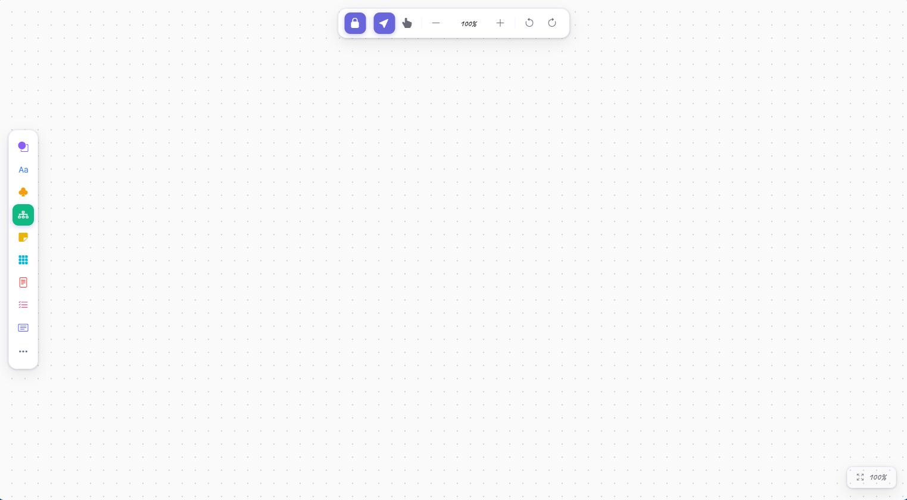

<div align="center">

# 🎨 Infinite Task Manager Canvas

**一款无限画布任务管理平台基于 React 实现 —— 让你的任务在无限空间中自由发挥创作**

[](https://react.dev)
[](https://vitejs.dev)
[](https://reactrouter.com)
[](LICENSE)
[](#)


[](#)

</div>

---

## ✨ 特性一览

> 把任务、想法、文档全部铺在一张无限延伸的画布上，像思维导图一样自由管理你的任务和创意。

### 核心能力

- 🌌 **无限画布** —— 平滑平移、自由缩放（50% ~ 400%），视野永不受限
- 🎯 **点阵网格** —— 点阵背景提供视觉锚点，让布局井然有序
- 🧩 **九大工具** —— 形状流程图、文字、手绘、思维导图、便利贴、表格、文档、列表、卡片
- 🔲 **框选操作** —— 矩形选区，批量选中移动，高效管理元素
- 🔍 **缩放 HUD** —— 右下角悬浮面板，一键缩放回 100%
- ⌨️ **指针事件** —— 统一 Pointer Events，触摸/鼠标/笔全平台兼容

### 设计亮点

- 🎨 精心调配的紫色主色调体系（`#6965db`），视觉舒适
- 🌑 多层细腻阴影系统，模拟 macOS 质感
- 📐 可维护的 CSS Variables 设计令牌，全局一致性

### 展示效果



---

## 📦 技术栈

| 技术 | 版本 | 用途 |
|------|------|------|
| React | 19.x | UI 框架 |
| React Router | 7.x | 路由管理 |
| Vite | 8.x | 构建工具 |
| Bootstrap Icons | 1.13.x | 图标库 |
| Caveat Variable | 5.x | 手写风字体 |
| OxLint | 1.x | 代码检查 |

---

## 🚀 快速开始

### 环境要求

- Node.js ≥ 18
- npm / pnpm / yarn

### 安装依赖

```bash
npm install
```

### 启动开发服务器

```bash
npm run dev
```

浏览器打开 `http://localhost:5173` 即可访问。

### 构建生产版本

```bash
npm run build
```

### 预览生产构建

```bash
npm run preview
```

### 代码检查

```bash
npm run lint
```

---

## 📂 项目结构

```
infinite-task-manager-canvas/
├── src/
│   ├── assets/                  # 静态资源
│   ├── HomeContainer/           # 首页组件
│   │   ├── index.css
│   │   └── index.jsx
│   ├── NotFound/                # 404 页面
│   │   ├── index.css
│   │   └── index.jsx
│   ├── TaskCanvas/              # 核心画布模块
│   │   ├── index.css            # 画布容器样式
│   │   ├── index.jsx            # 画布主组件（缩放/平移/点阵绘制）
│   │   ├── SelectionOverlay/    # 框选覆盖层
│   │   │   ├── index.css
│   │   │   └── index.jsx
│   │   └── TaskStorage/         # 工具栏与侧边栏
│   │       ├── index.css
│   │       ├── index.jsx
│   │       ├── LeftSidebar/     # 左侧工具栏（九大工具）
│   │       │   ├── index.css
│   │       │   └── index.jsx
│   │       └── AboveSidebar/    # 顶部导航栏
│   │           ├── index.css
│   │           ├── index.jsx
│   │           └── HudMenu/     # 缩放百分比菜单
│   │               ├── index.css
│   │               └── index.jsx
│   ├── App.jsx                  # 路由入口
│   ├── main.jsx                 # 应用入口
│   └── index.css                # 全局设计令牌
├── public/
├── index.html
├── package.json
├── vite.config.js
└── .oxlintrc.json
```

---

## 🎮 使用指南

### 路由

| 路径 | 页面 | 说明 |
|------|------|------|
| `/` | 首页 | 欢迎页 |
| `/task-canvas-container` | 任务画布 | 核心功能区 |
| `*` | 404 | 未匹配路由 |
